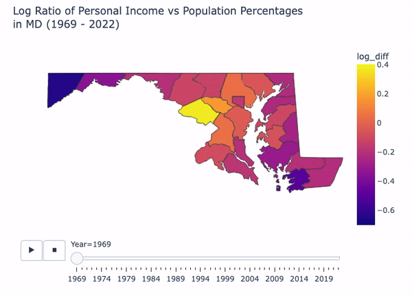

# Data Scientist

Competent data scientist with 5+ years of experience combining computational and quantitative analysis skills to address complex research questions. Proficient in data mining, data processing, and statistical modeling with R and Python to extract pertinent information from big data sources.

## Education
    |:---|---:|
  * |Master's in Applied Mathematics | |
    |Arizona State University | May 2019|
  * |Bachelor's in Mathematics & Biology  University of NC, Greensboro | May 2017|

## Work Experience
#### May 2022 - Present | Data Scientist

#### August 2019 - April 2022 | Research Fellow, National Institutes of Health
  - Developed analysis pipelines to streamline the identification of cancer risk-associated variants from multi-dimensional genomic data.
  - Created custom Bash and R scripts for cleaning, extracting, formatting, and processing several terabytes of complex data.
  - Applied high-performance computing techniques to optimize efficiency of jobs submit to the NIH compute cluster.
  - Harmonized publicly available and internal data sources.
  - Employed advanced data visualization tools to communicate key results to collaborators and other non-experts.

## Projects
I have done many things, but here are a select few.

### Personal Project \#1

Here is a personal project that I did one day because I was bored. 
This is an animation showing the process of finding the line of best fit for a least squares linear regression. The code used to generate this graphic and more details can be found [here](https://github.com/kmfunde/DS-projects/tree/194bda069e9c8220c159d71c3114e7df4835abf9/example-project).

### Time-Series Analysis of Personal Income Trends in Maryland

This is another thing I did because I was bored. More details and the code used can be found [here.](https://github.com/kmfunde/DS-projects/tree/dc04f76d3725581ef968782216a24770d510e078/personal-income)

## Publications
  1. **Funderburk, K.**, Bang-Christensen, S. R., Miller, B. F., Tan, H., Margolin, G., Petrykowska, H. M., ... & Elnitski, L. (2023). Evaluating Stacked Methylation Markers for Blood-Based Multicancer Detection. *Cancers, 15*(19), 4826.
  2. Long, E., Yin, J., **Funderburk, K. M.**, Xu, M., Feng, J., Kane, A., ... & Choi, J. (2022). Massively parallel reporter assays and variant scoring identified functional variants and target genes for melanoma loci and highlighted cell-type specificity. *The American Journal of Human Genetics, 109*(12), 2210-2229.
  3. DeLory, T., **Funderburk, K.**, Miller, K., Zuluaga-Smith, W., McPherson, S., Pirk, C. W., ... & Rueppell, O. (2020). Local variation in recombination rates of the honey bee (Apis mellifera) genome among samples from six disparate populations. *Insectes sociaux, 67*, 127-138.
  4. Kaur, A., **Funderburk, K.**, Campaña, A. L., Puente, P., & Ríos-Soto, K. R. (2019). A household model of German cockroach infestations and their effects on symptoms of atopic asthma. *Letters in Biomathematics, 6*(2), 1-26.
  5. **Funderburk, K. M.**, Auerbach, S. S., & Bushel, P. R. (2017). Crosstalk between receptor and non-receptor mediated chemical modes of action in rat livers converges through a dysregulated gene expression network at tumor suppressor Tp53. *Frontiers in genetics, 8*, 157.

