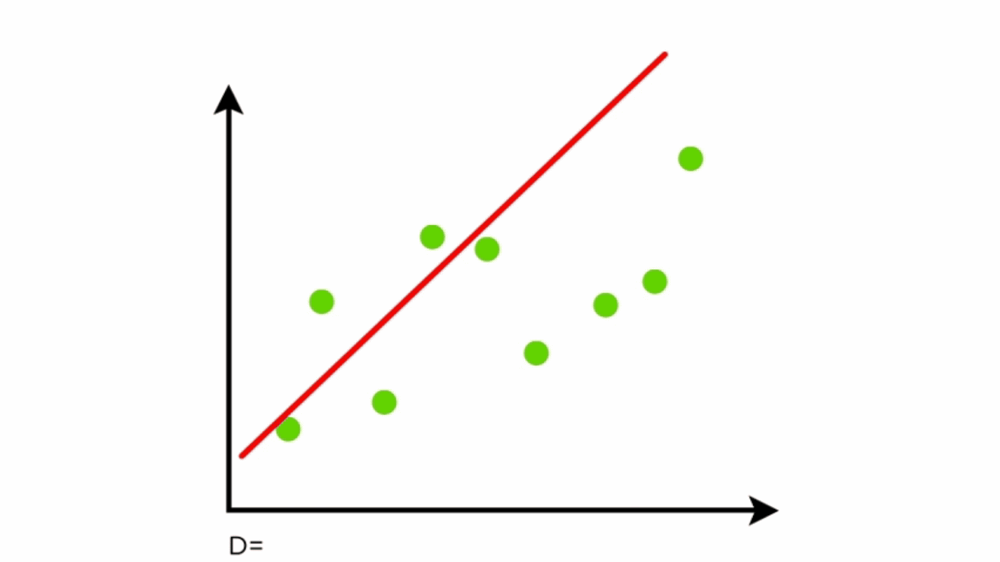

# Data Scientist

Accomplished and innovative data scientist with 7+ years of experience combining computational and quantitative analysis skills to translate complex datasets into actionable insights. Demonstrated success in deploying data-driven strategies to optimize processes by applying advanced data analysis and machine learning techniques in R and Python.

## Education
  * | :------ | ------: |
    |Master's in Applied Mathematics  Arizona State University | May 2019|
  * | :------ | ------: |
    |Bachelor's in Mathematics & Biology  University of NC, Greensboro | May 2017|

## Work Experience
#### May 2022 - Present | Data Scientist, Department of Defense
  -	Developed a multi-faceted scoring system in Python to pinpoint selectors whose activity was highly correlated with current targets, increasing efficiency of new target discovery by 68%.
  -	Conducted time-series analyses to detect anomalous adversarial activity and classify future data points.
  -	Uncovered key connections by using graph theoretical methods to analyze and identify patterns within large-scale networks representing target traffic. 
  -	Trained natural language processing model to accurately annotate and extract pertinent information from unstructured text input for downstream utilization in machine learning pipelines. 
  -	Leveraged big data analysis methods in Apache Spark to load, clean, and summarize an 80+ TB cybersecurity dataset into digestible insights, resulting in improved prioritization of customer targeting efforts. 
  -	Built interactive HTML data visualizations to effectively summarize key findings from complex information.
  -	Facilitated recurring team meetings to encourage collaboration and created internal website to serve as a central repository for team resources.

#### Aug 2019 - Apr 2022 | Research Fellow, National Institutes of Health
  - Constructed analysis pipelines to streamline the identification of cancer risk-associated variants from multi-dimensional genomic data.
  - Created custom Bash and R scripts for cleaning, extracting, formatting, and processing 10+ TB of complex data.
  - Applied high-performance computing techniques to optimize efficiency of jobs submit to the NIH compute cluster.
  - Harmonized publicly available and internal data sources.
  - Employed advanced data visualization tools to communicate key results to collaborators and other non-experts.
  - Trained colleagues on proper implementation of shared scripts.

## Projects
I have done many things, but here are a select few.

### Personal Project \#1

Here is a personal project that I did one day because I was bored. 
This is an animation showing the process of finding the line of best fit for a least squares linear regression. The code used to generate this graphic and more details can be found [here](https://github.com/kmfunde/DS-projects/tree/194bda069e9c8220c159d71c3114e7df4835abf9/example-project).

### Time-Series Analysis of Personal Income Trends in Maryland

This is another thing I did because I was bored. More details and the code used can be found [here.](https://github.com/kmfunde/DS-projects/tree/dc04f76d3725581ef968782216a24770d510e078/personal-income)

## Publications
  1. Long, E., Patel, H., Golden, A., Antony, M., Yin, J., **Funderburk, K.**, ... & Choi, J. (2024). High-throughput characterization of functional variants highlights heterogeneity and polygenicity underlying lung cancer susceptibility. *The American Journal of Human Genetics, 111*(7), 1405-1419. 
  2. **Funderburk, K.**, Bang-Christensen, S. R., Miller, B. F., Tan, H., Margolin, G., Petrykowska, H. M., ... & Elnitski, L. (2023). Evaluating Stacked Methylation Markers for Blood-Based Multicancer Detection. *Cancers, 15*(19), 4826.
  3. Long, E., Yin, J., **Funderburk, K. M.**, Xu, M., Feng, J., Kane, A., ... & Choi, J. (2022). Massively parallel reporter assays and variant scoring identified functional variants and target genes for melanoma loci and highlighted cell-type specificity. *The American Journal of Human Genetics, 109*(12), 2210-2229.
  4. DeLory, T., **Funderburk, K.**, Miller, K., Zuluaga-Smith, W., McPherson, S., Pirk, C. W., ... & Rueppell, O. (2020). Local variation in recombination rates of the honey bee (Apis mellifera) genome among samples from six disparate populations. *Insectes sociaux, 67*, 127-138.
  5. Kaur, A., **Funderburk, K.**, Campaña, A. L., Puente, P., & Ríos-Soto, K. R. (2019). A household model of German cockroach infestations and their effects on symptoms of atopic asthma. *Letters in Biomathematics, 6*(2), 1-26.
  6. **Funderburk, K. M.**, Auerbach, S. S., & Bushel, P. R. (2017). Crosstalk between receptor and non-receptor mediated chemical modes of action in rat livers converges through a dysregulated gene expression network at tumor suppressor Tp53. *Frontiers in genetics, 8*, 157.

